# BorodaFM — интернет-радио для автомагнитолы и телефона

Здесь публикуются **готовые сборки (APK)** приложения BorodaFM.
Исходный код проекта в этом репозитории не хранится — только сами релизы и служебный
манифест для авто-обновления.

<!-- current-version -->
**Последняя версия: 2.12.23** · [скачать из Releases](../../releases/latest)
<!-- /current-version -->

Приложение умеет проверять обновления само: раз в сутки оно смотрит манифест
и предлагает скачать новую версию.

---

## Что умеет приложение

<!-- features-start -->
## Станции

- **Станций в каталоге: 106** — российские (включая каналы сторонний каталог), белорусские и др.
- **Добавление своих станций** — можно ввести название, ссылку на поток, выбрать жанр и (опционально) указать ссылку на логотип. Свои станции сохраняются и остаются после перезапуска. **Поддерживаются и HTTP-, и HTTPS-потоки.** При вводе HTTP-адреса приложение показывает предупреждение о том, что поток не шифруется и может быть подменён — можно отменить или всё равно добавить. Ссылки `file://`, `content://` и другие нестандартные схемы отклоняются.
- **Жанры для своих станций** — при добавлении/редактировании станции можно выбрать жанр из подсказок (Поп, Рок, Ретро, Шансон и т.д.) или ввести свой. Новый жанр сразу появляется на экране «Жанры».
- **Логотипы** — у всех станций есть иконка. Для кастомных станций логотип подгружается по URL автоматически.
- **Фильтр по жанрам** — на отдельном экране «Жанры» можно выбрать жанр (Поп, Рок, Ретро, Шансон, Танцевальная, Детское и т.д.) и видеть только его станции на главном. **На каждой плитке жанра показано количество станций** — например, «Поп · 12 станций». Счётчики обновляются автоматически при добавлении или удалении станции.

---

## Жанры

- **Отдельный экран «Жанры»** — открывается кнопкой внизу на главном.
- **Плитки с градиентами** — у каждого жанра свой цвет, визуально связан со станциями этого жанра.
- **Счётчики** — на каждой плитке под названием указано число станций: «12 станций».
- **«Все жанры»** — первая плитка, сбрасывает фильтр.
- **Тап на жанр** → мгновенный переход на главную с отфильтрованной сеткой. Один тап — сразу результат.
- **Активный жанр** — плитка выделена обводкой в цвет акцента.
- **Адаптивная сетка** — на ГУ 4 колонки, на телефоне 2–3.

---

## Воспроизведение

- **Качество звука** — четыре режима: Авто, Высокое (320 kbps), Среднее (128 kbps), Низкое (64 kbps). В режиме «Авто» качество меняется **по факту заиканий, а не по пингу**: аудиопоток занимает ≈40 КБ/с и спокойно играет даже на узком канале, поэтому при чистом эфире всегда остаётся Высокое. Заикания (долгая буферизация, срывы потока) опускают качество на один шаг, после чего 2 минуты переключений нет; возврат вверх — редко (не чаще раза в 10 минут) и только при отсутствии заиканий. Уровень, на котором станция долго играла стабильно, запоминается — в следующий раз она включается сразу с него (без прыжков). Ручной выбор качества «Авто» не оспаривает.
- **Автопереключение при проблемах** — если поток обрывается или плохо играет, приложение пробует резервные ссылки.
- **Сообщение о качестве** — над плеером (в нижней части экрана) появляется полоска: «Высокое (320 kbps), отличный сигнал, 13 мс, авто». Через 5 секунд сообщение исчезает. Цвет текста зависит от качества: зелёный — высокое, оранжевый — среднее, красный — низкое. Сообщение показывается **и на главном экране, и на экране «Избранное»**, а также служит для индикации проблем с сетью («Ожидаем появление интернета…»).
- **Радио играет в фоне** — можно свернуть приложение, и радио продолжит играть.
- **Выравнивание громкости между станциями** — громкость разных станций сама подтягивается к общему уровню: тихие делаются громче, громкие — тише, плавно и незаметно для слуха. Уровень каждой станции запоминается, поэтому знакомая станция включается уже ровно. Работает по фактическому уровню звука, без ручных «накруток».
- **Продолжение без «хвоста»** — после паузы звук продолжается живым потоком; пара секунд из буфера не доигрывается.
- **Холодный старт на мобильной сети.** На ГУ с 4G-модемом первый старт радио может занять 0.5–3 секунды: устанавливается HTTP-соединение с потоком и наполняется буфер. Это нормальное поведение плеера, а не сбой. На домашнем Wi-Fi/Ethernet старт почти мгновенный, а переключение между станциями после первого запуска идёт быстрее — соединение уже открыто.

---

## Кнопки руля

- **Play / Pause**, **Следующая / Предыдущая станция** — работают с руля и с панели ГУ.
- **Работают и на экране «Сейчас играет»** — кнопки ⏮ ⏯ ⏭ и медиа-клавиши руля надёжно переключают станции, в том числе когда открыт полноэкранный плеер.
- Если открыт экран «Избранное», кнопки ⏮ ⏭ ходят **только по избранным** станциям.
- На главном экране — по всей сетке.

---

## Избранное

- **Отдельный экран** «Избранное» — все станции, отмеченные звёздочкой, в одном месте.
- Отметить/снять можно **долгим нажатием** по плитке на главном экране или с экрана «Избранное».
- Избранное **сохраняется между запусками** — после перезагрузки всё на месте, **включая ваши собственные станции** (не слетают даже кастомные).

---

## История прослушивания

- **Последние 20 станций** — горизонтальная полоса карточек над сеткой.
- Можно **включить/выключить** в настройках.
- Если история не нужна — отключается в один клик.

---

## Эквалайзер

- **14 готовых пресетов**: Обычный, Классика, Рок, Поп, Джаз, Клуб, Live, Акустика, Вокал, Басы, Bass Boost, Treble Boost, а также стандартные Android.
- **Bass Boost и Treble Boost** — эмуляция: поднимают низкие/высокие частоты. **Плавный переход** — звук меняется без хрипа за 0.2 секунды.
- **Ручная настройка полос** — можно подкрутить каждую частоту ползунком.
- **Усиление баса** — отдельный регулятор `BassBoost` (не путать с пресетом Bass Boost — они работают независимо).
- **Объёмный звук** — `Virtualizer`: расширение стерео, эффект «пространства». Режимы: Выкл / Слабо / Средне / Сильно.
- **Всё сохраняется** — после перезапуска пресет, полосы, Bass Boost и Объёмный звук остаются на месте.
- **Кнопка сброса** — с подтверждением. Возвращает все настройки эквалайзера в исходное.
- **Включён по умолчанию** — обработка звука доступна сразу, как и было изначально.
- **Плавный старт и защита звука.** Эффекты создаются через 2 секунды после начала
  воспроизведения (раньше audioSessionId ещё не готов; их инициализация кратко перезапускает
  AudioTrack). Если сразу после этого звук пропал, а поток при этом жив (нет ошибок) — приложение
  считает виновником эффекты, отпускает их и перезапускает поток: **звук важнее обработки**.
  Дальше в этой сессии они не создаются (в журнал пишется `Eq muteGuard`), но включаются снова,
  если пользователь сам меняет настройки в «Эквалайзере».
- **UI синхронизирован со звуком.** При выборе Bass/Treble Boost ползунки плавно переезжают — UI получает сигнал от RadioService после завершения интерполяции.
- **Выключатель — вверху экрана.** `Switch` вкл/выкл эквалайзера — **перед секцией «Пресеты»**. Один взгляд, одно нажатие.

---

## Навигация

- **Единая нижняя панель** на всех экранах: `[←]` `[Меню]` `[Избранное]` `[Жанры]`.
- **`[←]` (стрелка назад)** — маленькая иконка без текста. Показывается **на всех экранах, кроме главной**. Куда ведёт — зависит от экрана:
  - **Настройки**, **Эквалайзер**, **Избранное**, **Жанры** → на главную.
  - **Управление станциями** → в настройки.
  - **Экран «Сейчас играет»** → туда, откуда открыли (главная / избранное / жанры).
- **На ГУ — иконка «домой» вместо стрелки.** Там, где возврат ведёт на главную (Настройки, Эквалайзер, Избранное, Жанры), на ГУ показывается кнопка «домой» `[⌂]`. Для шага назад (например, Управление станциями → Настройки) и на телефоне — всегда стрелка.
- **Меню** — открывает BottomSheet с пунктами «Эквалайзер», **«Статистика прослушивания»** и «Настройки». Доступно из **любого** экрана.
- **Избранное** и **Жанры** — отдельные экраны, доступны **1 тапом** с любого экрана.
- **Верхних панелей нет** — весь интерфейс строится вокруг нижних кнопок.
- **Адаптивные размеры** — на ГУ кнопки крупнее, на телефоне компактнее.

---

## Настройки

- **Тема оформления** — светлая, тёмная, авто (по времени суток).
- **Качество звука** — Auto / High / Medium / Low.
- **Размер плиток** — **«Плиток в ряд»**: ползунок от 2 до 6 на телефоне (на ГУ — до 12). Меньше колонок — крупнее логотипы (на слабом ГУ крупнее значит меньше плиток в кадре и легче прокрутка); сетка всегда ровно во всю ширину экрана. Настраивается **визуально на главном экране**: в настройках пункт «Размер логотипов» уводит на главную и открывает ползунок поверх сетки станций — двигаешь и сразу видишь результат. По умолчанию — авто по ширине экрана; вернуть подбор по экрану можно кнопкой **«Авто»** прямо в редакторе. Значение сохраняется между запусками и переживает обновление приложения.
- **Автозапуск** — при запуске приложения автоматически включается последняя станция. Работает и при загрузке устройства.
- **Открывать последнюю вкладку** — если включено, при запуске приложение открывает ту вкладку, на которой вы закрыли его в прошлый раз (главная или «Избранное»). По умолчанию выключено — старт с главной. Служебные экраны (Настройки, Эквалайзер, Управление станциями) не запоминаются.
- **Названия станций** — можно скрыть текст на плитках для минималистичного вида.
- **Затемнение плиток** — вкл/выкл нижнюю тень под названием.
- **История прослушивания** — вкл/выкл.
- **Список станций** — обновление каталога без переустановки приложения. Показано, сколько станций и когда список обновлён; кнопка **«Обновить список»** проверяет каталог вручную (автоматически — раз в сутки). Снятые с вещания станции скрываются, избранное и история сохраняются. Появившиеся станции отмечаются значком **NEW** (7 дней), а при обновлении каталога один раз показывается баннер «Каталог обновлён: +N станций» — о той же версии каталога повторно не напоминает. Если вы добавляли станцию, которая позже появилась в каталоге, дубликаты **объединяются автоматически** (совпадение по URL потока или по id): потоки пользователя становятся **резервными**, а избранное и история переносятся на каталоговую станцию. **Если оборвётся основной поток, плеер автоматически переключится на резервный.** Похожие по названию пары предлагается объединить (баннер «Похоже, у вас есть дубликаты…»), а в настройках есть кнопка **«Проверить дубликаты»** с ручным подтверждением; при добавлении станции вручную приложение предупреждает, если похожая уже есть.
- **Проверка обновлений приложения** — раз в сутки приложение само смотрит, не вышла ли новая версия, и **тихо скачивает её в фоне**; диалог сам не всплывает, а по готовности приходит уведомление «Обновление готово к установке» (установка — по тапу по нему или из настроек). Проверку можно **выключить в настройках** — раздел «Обновление приложения» (там же кнопка **«Проверить обновления»** и кнопка **«Обновить»**, когда версия доступна). **Браузер не нужен**: APK скачивается самим приложением и передаётся системному установщику. Авто-проверка стартует не мгновенно, а через 15 секунд после появления интернета — чтобы не мешать запуску и началу воспроизведения.
- **Управление станциями** — экран со списком всех станций. Для **встроенных** доступно только **скрыть/показать**. Для **своих** (добавленных пользователем) — ещё **отредактировать** (карандаш: название, поток, логотип, жанр) и **удалить** (корзина). Удаление требует **подтверждения** — как на главном экране (долгое нажатие), так и на экране управления станциями.
- **Счётчик трафика** — сколько мегабайт израсходовано: за сессию, за месяц, за всё время. Подробнее — в разделе «Трафик».
- **Анонимная статистика** — отправка «пинга» (случайный id установки, версия, тип устройства — ГУ или телефон, модель устройства). **Включена по умолчанию**, но выключается в настройках; личных данных не отправляет. Нужна, чтобы понимать, сколько устройств пользуется приложением и на каких они версиях. Отключается переключателем — отправка прекращается сразу.
- **Инструменты (скрытый раздел)** — открывается **пятью быстрыми тапами** по блоку «О приложении» (там, где написано BorodaFM и версия). Первая карточка — **«Диагностика»**: сразу, без похода в журнал, видны версия, тип устройства и модель, состояние сети, размер журнала, было ли аварийное завершение и последняя запись о проблеме, а также частые события; кнопки «Открыть журнал», «Обновить» и «Отчёт для разработчика» (собирает всё в один текст для отправки проблемы). Вторая — **«Быстрые исправления»**: «Сбросить качество станций» (если станция упорно играет тихим потоком), «Перечитать список станций» (если не появляются новые станции каталога) и «Очистить историю» (удалить список прослушанного на этом устройстве). Третья — **«Для разработчика»**: свёрнутый служебный блок с телеметрией (ручная отправка пинга и статистики прослушивания, интервал 2/6/24 ч, просмотр JSON-пакетов, проверка сервера, сброс счётчиков, идентификаторы) — он есть **только в отладочной сборке**, в релизном APK его нет. Пока раздел открыт, автоматически ведётся **подробный журнал отправок**. Раздел **прячется сам**, как только вы уходите с экрана настроек; исключение — переход в «Диагностику» (после возврата раздел остаётся открытым). Что делает каждый пункт — в [docs/TOOLS.md](docs/TOOLS.md).
- **Диагностика** — экран с журналом событий приложения: запуски и паузы эфира, переключения качества (с причиной — заикания или состояние сети), сигналы ночного режима от ГУ, действия в настройках. Помогает разобрать «плавающие» проблемы (например, самопроизвольный запуск воспроизведения): видно, **кто именно** инициировал действие. Там же — версия, тип устройства, состояние сети и счётчики событий. Отдельно сохраняется **последнее аварийное завершение** (стек и события, которые были перед падением): видно прямо на этом экране даже при выключенном журнале, попадает в отчёт и очищается кнопкой. Отчёт можно **скопировать или переслать файлом**, а между устройствами — **передать по Wi-Fi** одним блоком «Передать отчёт по Wi-Fi» с двумя шагами: «Отдать отчёт» на одном устройстве показывает 4-значный код, «Получить отчёт» на втором вводит его и сразу предлагает «Отправить файлом» / «Скопировать» (работает в любую сторону — ГУ ↔ телефон, телефон ↔ телефон). Отправка — только по вашему действию, автоматической телеметрии нет. Журнал **ведётся по умолчанию** (переключатель «Вести журнал событий» — в скрытом разделе «Инструменты»), там же кнопка «Открыть журнал» (5 быстрых тапов по блоку «О приложении»).
- **Резервная копия** — сохранить и восстановить настройки, свои станции и избранное. Два способа:
  - **Файл** — сохраняется через системный выбор файла (в память телефона или в облако: Google Drive, Яндекс.Диск, Dropbox). Восстанавливается оттуда же, **в том числе после переустановки приложения**.
  - **По Wi-Fi** — «Отдать по сети» на одном устройстве и «Забрать по сети» на другом (оба должны быть в одной Wi-Fi сети). Удобно перенести настройки с телефона на ГУ и обратно, интернет не нужен. Перенос защищён **одноразовым 4-значным кодом**: он показан на раздающем устройстве, его нужно ввести на принимающем — так чужие устройства в той же сети не смогут скачать ваши данные.
  При импорте можно **заменить** текущие данные или **объединить** с ними. Счётчики трафика резервная копия не затрагивает.

---

## Обновление приложения

- **Проверка раз в сутки** — при запуске приложение тихо смотрит, не вышла ли новая версия, и не мешает воспроизведению. Если интернета нет — просто не проверяет, работе радио это не мешает.
- **Отключается в настройках** — раздел «Обновление приложения», переключатель «Проверять обновления».
- **Ручная проверка** — кнопка «Проверить обновления» в том же разделе настроек.
- **Диалог установки** — «Доступно обновление», версия, что нового и кнопка **«Установить»** (или **«Обновить»**, если файл ещё не скачан). Кнопка «Позже» — эта версия больше не предлагается. Авто-проверка сама диалог **не открывает**: он появляется по тапу по уведомлению или по кнопке «Проверить обновления» в настройках.
- **Обновление без браузера** — APK скачивается внутри приложения с прогрессом и отменой и передаётся **системному установщику**; браузер нужен только если установщика на устройстве нет. Это важно для автомагнитол, где браузера обычно не бывает.
- **Качается заранее и тихо** — если проверка нашла новую версию, APK **скачивается в фоне** (можно выключить переключателем «Скачивать обновления заранее»), а по готовности приходит уведомление **«Обновление готово к установке»**; диалог при этом **сам не всплывает** и не перекрывает радио. Тап по уведомлению открывает приложение с предложением установить: установка занимает одно подтверждение вместо «найти → скачать 12 МБ → подтвердить». Файл сохраняется и между запусками — если отложить, загрузка не повторится. Если авто-докачка выключена, обновление предлагается диалогом сразу, а загрузка идёт по кнопке.
- **Защита от подмены** — перед установкой сверяется `sha256` из подписанного манифеста и подпись APK с подписью установленной версии: чужой файл установить не получится.
- **Разрешение на установку** — Android один раз спросит «Установка неизвестных приложений»; приложение само открывает нужный экран настроек.
- **Ссылка защищена подписью** — адрес APK берётся из подписанного манифеста, подмена файла по пути исключена.
- **Релизы — отдельно от кода** — APK публикуется в публичном репозитории-дистрибутиве, основной код остаётся приватным.

---

## Статистика прослушивания

- **Что показывает** — сколько времени играла каждая станция: за сегодня, 7 дней, 30 дней и за всё время, плюс общий итог и долю каждой станции. Сразу видно **топ-10**, остальные станции — кнопкой «Показать все (N)».
- **Где открыть** — меню (кнопка «Меню») → «Статистика прослушивания».
- **Как считается** — по фактическому звуку: пауза, буферизация и ожидание сети в статистику не попадают. Время сохраняется раз в минуту, поэтому длинный эфир не теряется даже при перезапуске приложения.
- **Хранение** — только на этом устройстве. Итог за всё время хранится целиком, подробная разбивка по дням — 60 дней.
- **Сброс на устройстве** — кнопка «Сбросить статистику» на экране статистики (с подтверждением).
- **Сброс на сервере** — если отправка включена, на странице статистики есть кнопка «Сбросить прослушивание»: она очищает агрегаты станций и метки устройств (статистика установок не затрагивается). Уже присланные дни не возвращаются — их повторная отправка ничего не добавляет, — а новые минуты (в том числе за сегодня) начинают учитываться сразу. Данные на телефоне или ГУ при этом не трогаются.
- **Отправка на сервер — отдельным переключателем, включена по умолчанию** — «Статистика прослушивания» в настройках (при выключении сначала спрашиваем подтверждение). На сервер отправляются день, минуты и **топ-20 станций за этот день** — остальные суммируются в строку «Остальные станции», чтобы общий итог оставался честным, а редкие станции на сервер не уходили. Ни имён, ни треков, ни местоположения. На странице статистики видно общий топ станций по времени (топ-20). Подробности — в [docs/SECURITY.md](docs/SECURITY.md).

---

## Анонимная статистика

- **Включена по умолчанию, но выключается** — переключатель «Анонимная статистика» в настройках (раздел «Обновление приложения»). Выключили — отправка прекращается сразу.
- **Как часто** — не чаще раза в сутки; сразу после обновления приложения пинг отправляется вне очереди, чтобы версия в статистике не отставала.
- **Что отправляется** — случайный id установки (12 символов), версия приложения, тип устройства (ГУ или телефон), версия Android и модель устройства (плюс признак «эмулятор» — чтобы в статистике было видно тестовые установки). И больше ничего.
- **Чего не отправляется** — ни IP-адреса (не сохраняется на сервере), ни аккаунтов, ни местоположения, ни рекламных идентификаторов, ни списка ваших станций, ни истории прослушивания.
- **Зачем** — видеть, сколько устройств реально пользуется приложением, на каких они версиях и кто давно не выходит на связь (Android не сообщает об удалении приложения, поэтому «пропал» считается по отсутствию пингов дольше 30 дней).
- **Как посмотреть** — двойной клик по `tools/stats_worker/open_stats.command` (открывает страницу статистики в браузере по токену) или командой `python3 tools/install_stats.py --url https://borodafm-stats.borodafm.workers.dev --token <токен>`.

---

## Трафик

- **За эту сессию** — с момента запуска приложения.
- **За месяц** — календарный месяц, автоматически сбрасывается с началом нового.
- **За всё время** — накопительно.
- Ведётся **точно** — считаются все байты, которые плеер скачал из сети.
- **Сброс** — с подтверждением: диалог «Сбросить счётчик трафика?» с кнопками «Сбросить» и «Отмена», чтобы случайно не обнулить статистику.
- **Автостоп при паузе** — если поставить радио на паузу и не возобновлять 30 секунд, приложение автоматически останавливает поток. Это прекращает фоновую загрузку буфера и экономит трафик.
- **Пауза от ГУ и возврат** — когда на автомагнитоле гаснет экран (зажигание выключено), радио ставится на паузу без резких скачков звука. При включении станция запускается заново: с нулевой громкости, плавным подъёмом и **без «хвоста» прежнего эфира** из буфера. Приложение **измеряет**, как прошивка ГУ восстанавливает громкость (а не угадывает время), поэтому скачка звука нет в том числе после переустановки приложения или полного закрытия.
- **Устойчивость к обрывам потока** — если поток временно перестал отвечать, приложение перебирает резервные адреса и уровни качества, а затем повторяет попытку через 10 секунд. Сообщение «станция недоступна» появляется только если не ответил ни один адрес.

---

## Особенности для ГУ и телефона

- **На ГУ** — при сворачивании (нажатие «домика») радио продолжает играть в фоне.
- **На телефоне** — при свайпе из недавних приложение останавливается и закрывается. Звук при этом **плавно затухает за 0.2 секунды**, без резкого обрыва.
- **Свайп-назад на телефоне** — можно вернуться назад свайпом от **левого** или **правого** края экрана. Работает так же, как системная кнопка «Назад». На ГУ свайп-назад **отключён** — там жестов нет.
- **Смешные сообщения при старте без интернета** — если при запуске сеть ещё не поднялась (актуально на ГУ с 4G-модемом — 1–2 минуты), вместо сухого «Ожидаем интернет» показываются **юмористические фразы**: «Ожидаем диджеев — они как раз доливают кофе…», «Модем ушёл за сигаретами, скоро вернётся…» и т.д. Фразы идут в случайном порядке (без повторов) каждые 5 секунд, а в финале — «Всё выяснил: у вас просто нет интернета :)».
- **Поиск сигнала ГУ (на ГУ)** — если «Автоматически» не срабатывает, значит прошивка называет
  свой источник иначе. Кнопка **«Найти сигнал ГУ»** минуту наблюдает за системными параметрами
  (ничего в машине не меняя) — в это время нужно включить и выключить габариты; найденные
  параметры показываются со значениями «было → стало» и применяются одним нажатием. Рядом кнопка
  **«Показать параметры ГУ»**: полный список подходящих параметров прошивки с возможностью
  скопировать (для отчёта разработчику).
- **Ночной режим (на ГУ)** — экран приложения затемняется ночью, чтобы не слепить. Три варианта:
  **выключен**, **по времени** (с 21:00 до 07:00 — часы настраиваются) и **автоматически (с ГУ)** —
  приложение ориентируется на ночной режим головного устройства (системный или сигнал прошивки)
  или на датчик освещённости; если ГУ о ночи не сообщает, затемнение не включается, и приложение
  прямо подсказывает выбрать «По времени». Если прошивка ГУ рассылает свою команду ночного
  режима, её можно найти кнопкой **«Найти сигнал ГУ»** — приложение 60 секунд слушает типовые
  команды и показывает найденные (кнопка «Применить» подставляет их). При этом в системе ГУ
  ничего не меняется: только приём уведомлений, без прав и записи файлов. Яркость меняется
  **только у приложения** (системная яркость устройства не трогается), переход плавный;
  ночью можно автоматически включать тёмную тему. В настройках есть кнопка **«Проверить сейчас»**
  (ночной вид на 5 секунд) и строка «Сейчас: ночь/день · источник» — видно, что именно сработало.
- **Одна и та же сборка** — работает на обоих устройствах, автоматически подстраивается.
- **Холодный старт на 4G-модеме** — первый запуск радио на ГУ может занять 0.5–3 секунды (установка соединения, наполнение буфера). Дальше переключение станций идёт быстрее — соединение уже открыто.

---

## Экран «Сейчас играет»

- **Открывается тапом по PlayerBar** внизу экрана — на главной, в Избранном, везде.
- **Крупный логотип** станции — на ГУ **квадрат по высоте инфо** (от названия до низа истории), на телефоне — сверху.
- **Название, жанр, качество** — всё крупным шрифтом.
- **Звёздочка** — рядом с названием, добавить/убрать из избранного. Жёлтая = в избранном, белая = нет.
- **История** — 5 последних станций внизу. Тап → переключение. Без текстового заголовка — иконки сами по себе понятны.
- **Кнопки ⏮ ⏯ ⏭** — большие, удобные для ГУ.
- **Навигация по активному плейлисту** — если открыт из Избранного, ⏮ ⏭ ходят по избранному; из главного — по всей сетке.
- **`[←]` возвращает** туда, откуда открыли: из Избранного — в Избранное, из главного — на главную.
- **`[Меню] [Избранное] [Жанры]`** — переходы на любые экраны 1 тапом.
- **«Информация» (ГУ):** вертикальная вкладка у **правого края экрана, на уровне кнопок ⏮ ⏯ ⏭** — чтобы длинное название трека не перекрывалось. По тапу раскрывается панель: тип сети (🌐 Wi-Fi / 4G / Нет), **трафик за сеанс**, **запас канала** (во сколько раз сеть быстрее битрейта потока; близко к 1× — риск заиканий), битрейт (320 / 128 / 64 kbps), пинг (мс), дата и время. Открыта панель или нет — **запоминается**: при повторном заходе вид такой, каким вы его оставили. На телефоне — компактная строка под жанром: `🌐 Wi-Fi · 320 kbps · 30 мс`.
- **Текущий трек (ICY):** если станция отдаёт метаданные в потоке (ICY StreamTitle), под названием станции появляется **🎵 Artist - Track**. Не все станции это поддерживают — у таких строка не появляется. Работает на большинстве станций. Служебные ответы потока (например, JSON-заголовок у каналов сторонний каталог) распознаются и **не показываются**.

---

## Заставка

- **Крупный логотип** BorodaFM при запуске приложения — во весь экран, на чистом чёрном фоне, без рамок.
- **Логотип виден с первого кадра** — он рисуется сразу (дублируется фоном окна), поэтому не бывает «голос звучит, а картинки нет» при повторном запуске.
- **Озвучка приветствия** — короткая фраза голосом с лёгкой фоновой мелодией и громким финалом. Длительность заставки подстраивается под файл озвучки (обычно ~4 секунды); если файла нет — держится 0.8 секунды.
- **Без скачка громкости** — звук начинается в тишине и плавно поднимается; приложение **измеряет** восстановление громкости прошивкой ГУ, а не угадывает время, поэтому старт мягкий и на разных магнитолах.
- **Мягкий переход** — после озвучки короткая пауза, затем главный экран появляется кросс-фейдом, без «скачка» картинки.

---

## Внешний вид

- **Цветные плитки по жанрам** — у каждого жанра свой оттенок (приглушённый, не бьёт по глазам).
- **Играющая станция выделена «оправой»** — контрастный кант по краю (чёрный на светлой теме, белый на тёмной), зазор и внутри по периметру плитки **бегут насыщенные цвета**. Стиль движения меняется каждые 12 секунд (по часовой → против часовой → «маятник» с тёплой палитрой → «комета» → «две кометы навстречу» → «бегущие огни»), а смена идёт перекрёстным затуханием, поэтому переход незаметен. Яркость подсветки контура растёт с уровнем звука, название станции — зелёное. Доступ к уровню звука нужен только для визуализации (`RECORD_AUDIO`, запрашивается на любой версии Android); звук не записывается и не отправляется, а если разрешения нет — подсветка ровная.
- **Тёмная и светлая темы** — аккуратный современный стиль, скругления, мягкие разделители.
- **Адаптивная сетка** — количество колонок автоматически подстраивается под экран.
- **Плавная прокрутка на слабых ГУ** — логотипы станций ищутся один раз (общий кэш `LogoRes`), декодируются под нужный размер и лежат в одном кэше картинок на всё приложение (`Coil`), а не заново при каждом появлении плитки на экране. Логотипы первого экрана прогреваются сразу при загрузке списка, а **все остальные догружаются в фоне через пару секунд после старта** — при пролистывании не мелькают цветные подложки вместо картинок. Слои плитки (градиент и подсветка воспроизведения) рисуются одним проходом. Если на слабом ГУ прокрутка всё ещё тяжёлая — в настройках есть **«Размер логотипов»**: крупные плитки означают меньше плиток в экране, то есть меньше работы на каждый кадр.
- **Логотип на всю плитку** — картинка занимает всю плитку (без рамки), подложка по жанру видна там, где у логотипа прозрачный фон или пока картинка загружается.
- **Уведомление** — MediaStyle с логотипом станции и кнопками ⏮ ⏯ ⏭. Управление воспроизведением доступно также с экрана блокировки и через Bluetooth-гарнитуру.

---

## Безопасность

- **HTTPS для логотипов** — картинки станций загружаются только по HTTPS.
- **Проверка обновления** — APK обновления скачивается только по HTTPS, сверяется по `sha256` из подписанного манифеста и по сертификату подписи установленной версии: подменить файл или подсунуть чужой APK нельзя.
- **Импорт без опасных ссылок** — при восстановлении резервной копии принимаются только адреса станций вида `http://` и `https://`; `file://`, `content://` и прочие схемы отбрасываются.
- **Только стандартные схемы URL** — при добавлении станции принимаются только `http://` и `https://`, остальные схемы (например, `file://` или `content://`) отклоняются.
- **Предупреждение при HTTP** — если поток не шифрован, приложение предупредит об этом перед сохранением.
- **Автозапуск защищён** — сторонние приложения не могут инициировать запуск радио через системные broadcast-сообщения.
- **Надёжное избранное** — список избранного хранится в одном месте (только по id станции). Даже при редактировании или перезапуске приложения избранное не слетает.

---

**Коротко:** это полноценный интернет-радиоприёмник для машины и телефона. Станций в каталоге: 106. Есть избранное, история, эквалайзер, счётчик трафика, кнопки руля и работа в фоне. Всё в одном APK, ничего лишнего.
<!-- features-end -->

---

## Скриншоты

Показать скриншоты (телефон и автомагнитола)

### 📱 Телефон

Есть светлая и тёмная темы; интерфейс адаптируется под телефон и автомагнитолу.

  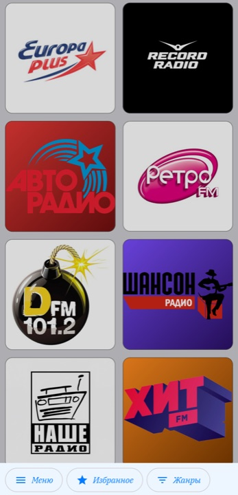
  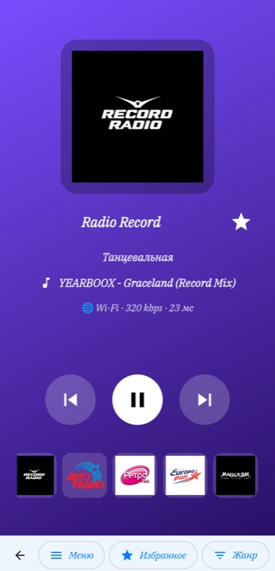
  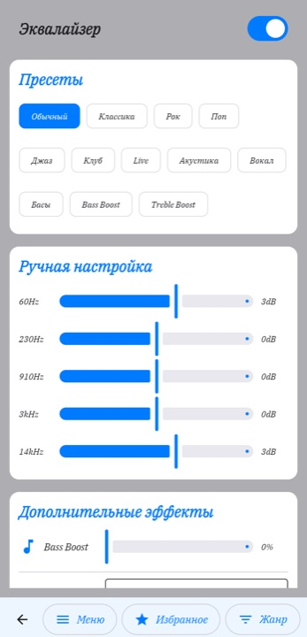
  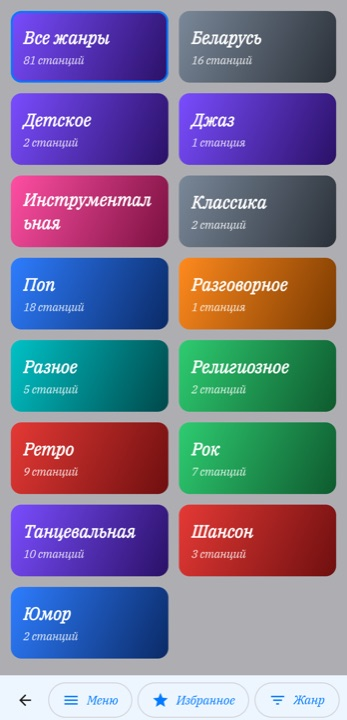

  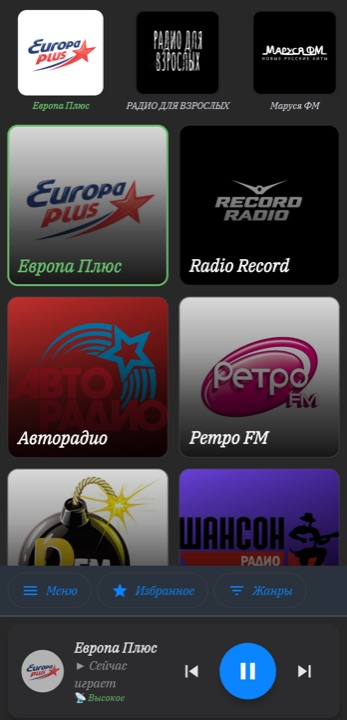
  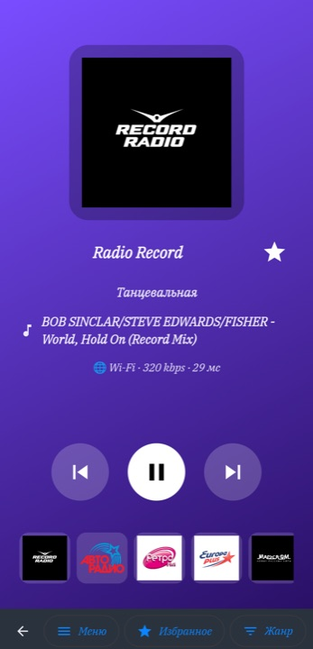
  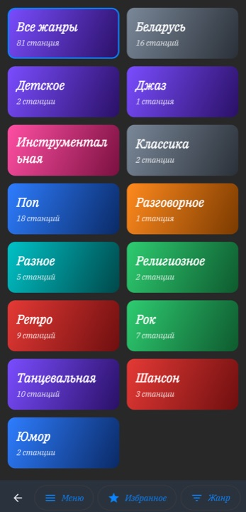
  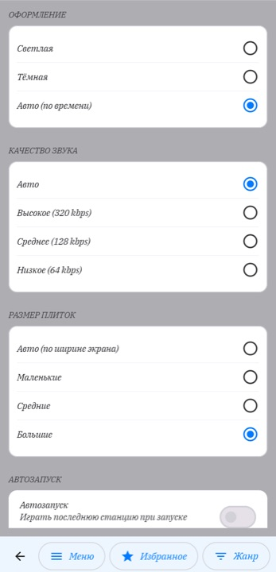

  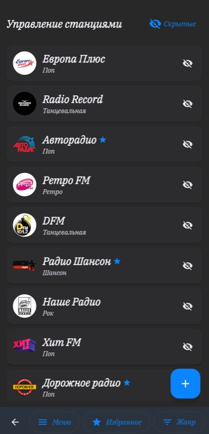
  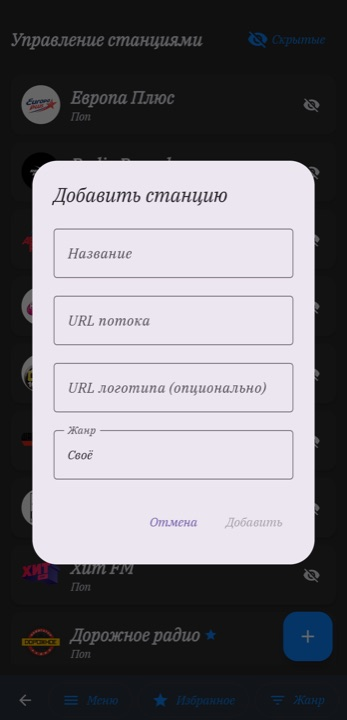
  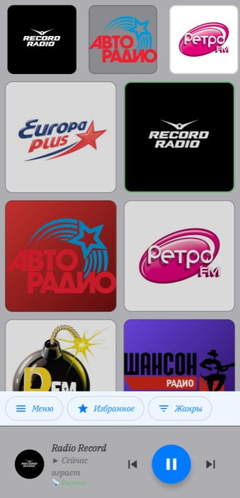
  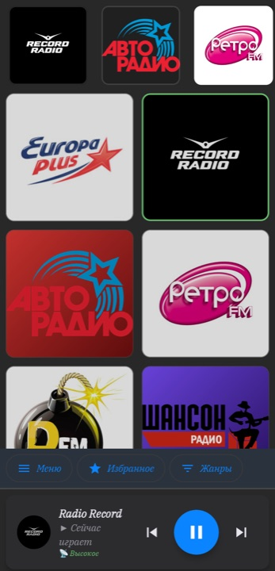

### 🚗 Автомагнитола (ГУ)

На автомагнитоле тот же интерфейс, но крупнее и под горизонтальный экран: кнопки и плитки
больше, навигация подстроена под управление с руля и тач. Ниже — съёмка с ГУ
(Android 8.1, экран 1920×1080), светлая и тёмная темы, «Названия станций» и «Затемнение плиток» включены.

  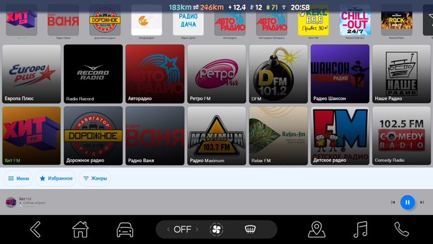
  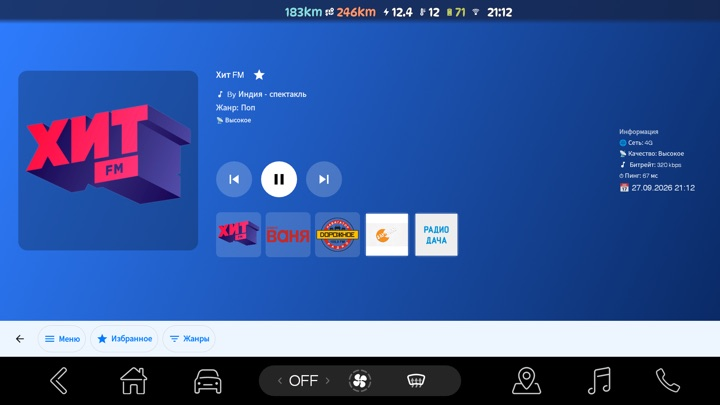
  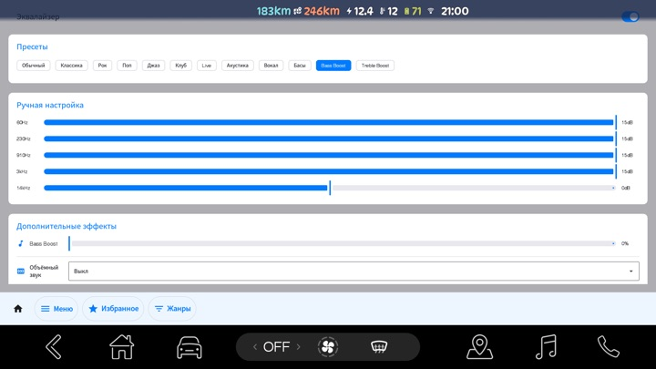
  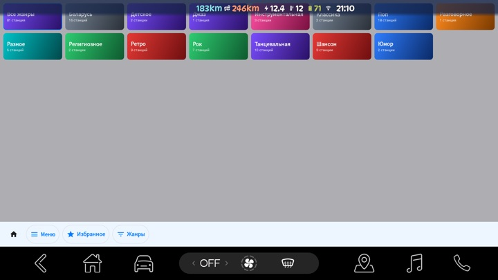

  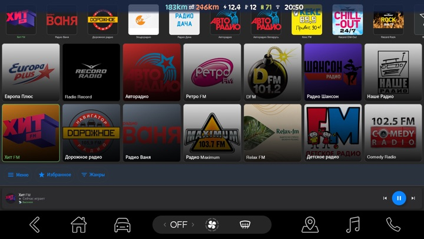
  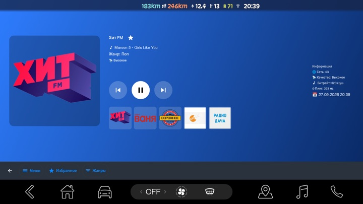
  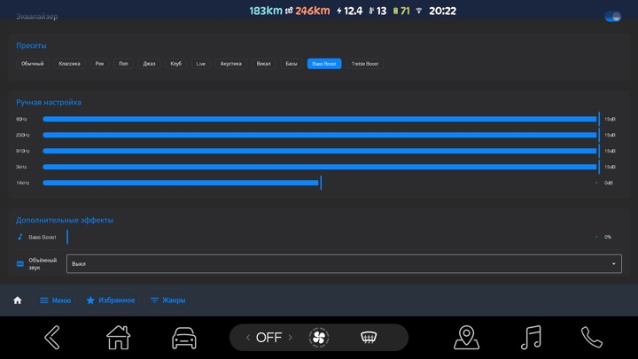
  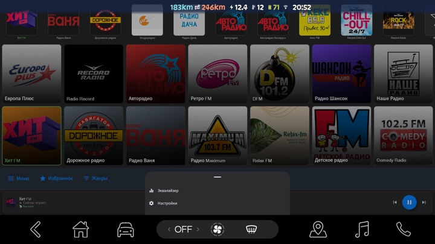

---

## Установка

1. Скачайте APK из раздела [Releases](../../releases/latest).
2. Откройте файл на устройстве и разрешите установку из этого источника.
3. Если ранее стояла сборка с другим ключом подписи (например, debug) — сначала удалите приложение.

**Требования:** Android 8.1 (API 27) и выше. Работает и на автомагнитоле, и на телефоне.

---

## Обновление

- Приложение само проверяет новую версию раз в сутки.
- Вручную: **Настройки → ОБНОВЛЕНИЕ ПРИЛОЖЕНИЯ → «Проверить обновления»**.
- Отключить авто-проверку можно там же — переключателем «Проверять обновления».
- Обновление скачивается самим приложением (с прогрессом и отменой) и передаётся системному
  установщику — **браузер не нужен**. Это важно для автомагнитол, где браузера может не быть.
  Установку подтверждает система.
- Файл проверяется: `sha256` из подписанного манифеста и подпись APK сверяются до установки.
- Если системного установщика на устройстве нет — приложение откроет ссылку в браузере.

---

## Служебное (для поддержки релизов)

- `docs/update.json` — манифест версии: `versionCode`, `versionName`, `apkUrl`, `sha256`, `notes`.
- `docs/update.json.sig` — detached-подпись манифеста (ECDSA P-256, SHA-256).
- Файл APK прикрепляется к релизу (в историю git не коммитится, чтобы не раздувать репозиторий).
- Приложение проверяет подпись манифеста публичным ключом, вшитым в сборку, и сравнивает
  `versionCode` со своим. Если версия в манифесте больше — предлагает скачать обновление.
